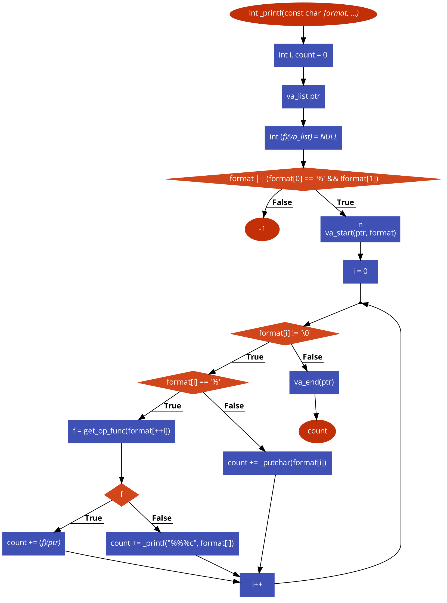

# A printf / sprintf Implementation for Embedded Systems

This is our printf implementation.

### Supported Types

| Type   | Output |
|--------|--------|
| d or i | Signed decimal integer |
| u      | Unsigned decimal integer	|
| b      | Unsigned binary |
| o      | Unsigned octal |
| x      | Unsigned hexadecimal integer (lowercase) |
| X      | Unsigned hexadecimal integer (uppercase) |
| c      | Single character |
| s      | String of characters |
| p      | Pointer address |
| %      | A % followed by another % character will write a single % |

### Return Value

Upon successful return, _printf returns the number of characters written, _excluding_ the terminating null character used to end the string.
If any error is encountered, `-1` is returned.

### Flowchart

